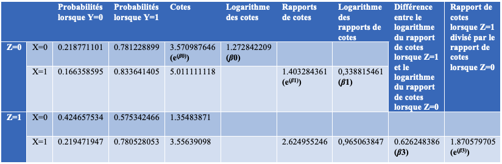
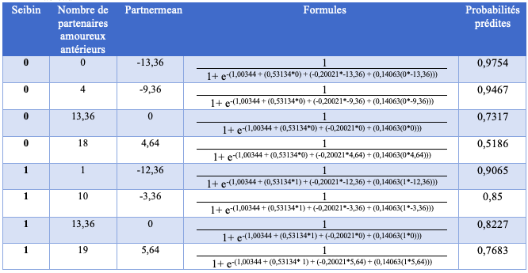
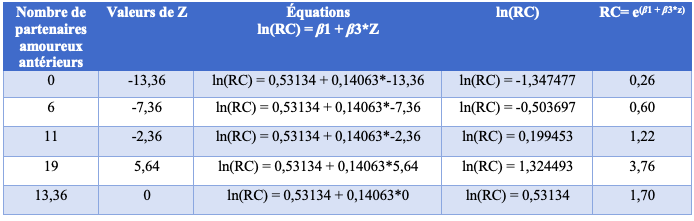
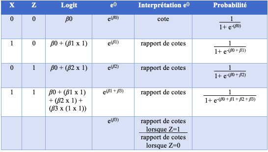

\
\

•	Ce tutoriel a pour but de vous aider à interpréter l’effet d'interaction dans une régression logistique, ainsi que ses coefficients. Nous utiliserons le logiciel $R$, mais sachez que les explications sont bonnes pour tous les logiciels d’analyses statistiques (SPSS, STATA, SAS, etc.).

•	Nous considérons que vous connaissez les bases de la régression logistique et que vous êtes familier avec la notion d’effet d'interaction en statistique. En guise de rappel, l’équation générale de la régression logistique est la suivante :

$logit(P) = ln(\frac{P}{1-P}) = {\beta_0}\:+\:({\beta_1}^*{x_1})\:+\:...\:+\:({\beta_k}^*{x_k})$

•	Notez que les données utilisées sont fictives, et ce, dans le but d’aider l’interprétation des coefficients et de l’effet d'interaction. Elles ont été modifiées pour nous permettre d’analyser des coefficients significatifs ($p$<0.05). Dès lors, toutes les interprétations fournies ne doivent en aucun cas être considérées comme reflétant la réalité. 

•	Enfin, il est à noter que plusieurs notations peuvent être utilisées pour désigner la fonction exponentielle. Certains utilisent $exp(\beta)$ et d’autres $e^{(\beta)}$. Dans ce tutoriel, nous opterons pour cette dernière. 
\
\
Les *packages* et la base de données utilisés lors de ce tutoriel sont les suivants :

```{R, message=FALSE, warning=FALSE}
library(ggplot2)
library(sjPlot)
library(magrittr)
```

```{R}
URL <- "https://raw.githubusercontent.com/Labo-Lacourse/tuto-reg-logistique-interactions/main/reglog.csv"
basededonnees <- read.csv(URL)
```

\
Contrairement à la régression linéaire, lorsqu’un terme d’interaction est présent dans un modèle de régression logistique, l’interprétation des coefficients est plus complexe étant donné que ces derniers nécessitent des transformations. 


Nous présenterons 3 cas de figure, soit lorsque nous sommes confrontés à 1) deux variables indépendantes catégorielles binaires, 2) une variable catégorielle binaire et une variable intervalle/ratio et 3) deux variables de type intervalle/ratio. Chaque cas de figure comprendra le codage dans le logiciel $R$, l’interprétation des coefficients et les calculs à partir des équations de régressions, tous nécessaires pour produire et interpréter l’effet d'interaction dans une régression logistique. 

Tout au long de nos explications, nous utiliserons les mêmes variables. Plus précisément, nous interpréterons l’effet d'interaction entre le statut socioéconomique (*sei*) et le nombre de partenaires amoureux antérieurs (*partner*) dans leur influence sur le statut marital (*marital*). Nous souhaitons donc savoir ce qui influence la probabilité d’être marié. Avant de débuter, assurez-vous que pour chaque cas de figure la variable dépendante *marital* ait d’abord été transformée en facteur.

```{R}
basededonnees$marital <- as.factor(basededonnees$marital)
levels(basededonnees$marital) <- c("non marié", "marié")
```
\

# Cas de figure

## 1. Deux variables indépendantes catégorielles binaires

\
Ayant un score qui varie entre 0 et 100, la variable indépendante *sei* (X) a été dichotomisée arbitrairement de manière à comparer deux groupes d’individus, soit ceux ayant un statut socioéconomique plus petit ou égal à 50 et ceux ayant un statut socioéconomique plus grand que 50. Cette nouvelle variable répond au nom de *seibin*.

```{R}
summary(basededonnees$sei)
```
```{R}
basededonnees$seibin[basededonnees$sei<=50] <- 0
basededonnees$seibin[basededonnees$sei> 50] <- 1
basededonnees$seibin <- as.factor(basededonnees$seibin)
levels(basededonnees$seibin) <- c("50 et moins", "Plus de 50")
```

\
Étant elle discrète, la variable modératrice *partner* (Z) a une distribution qui varie entre 0 et 20. Elle a été dichotomisée pour nous permettre de comparer les individus ayant eu 15 partenaires amoureux et moins à ceux ayant eu plus de 15 partenaires amoureux. Cette nouvelle variable se nomme *partnerbin*.
```{R}
summary(basededonnees$partner)
```
```{R}
basededonnees$partnerbin[basededonnees$partner<=15] <- 0
basededonnees$partnerbin[basededonnees$partner> 15] <- 1
basededonnees$partnerbin<- as.factor(basededonnees$partnerbin)
levels(basededonnees$partnerbin) <- c("15 et moins", "Plus de 15")
```

\
Commençons l’analyse en produisant d’abord la régression dans $R$ :
```{R}
reg1 <- glm(marital ~ seibin*partnerbin, data = basededonnees, family="binomial")
summary(reg1)
exp(coef(reg1))
```

\
Lorsque vous faites face à deux variables binaires, il est plus facile de se représenter à quoi correspondent les coefficients avec l’aide d’un tableau croisé. Pour y arriver, il faut d’abord obtenir les fréquences observées.

```{R,results='hide'}
tableau <- xtabs(~ marital+seibin+partnerbin, data = basededonnees)
tableau
```
```{R}
tab <- tableau%>%ftable(row.vars=c("partnerbin", "marital"))
tab
```

\
Tout au long de cet exemple, nous présenterons les calculs permettant d’obtenir les coefficients de régressions. Bien entendu, les résultats présents dans le Tableau 1 divergent un tant soit peu de ceux obtenus avec $R$, puisque les premiers sont obtenus à l’aide des probabilités observées, alors que $R$ estime par la méthode de maximum de vraisemblance les coefficients qui, par la suite, nous permettent de prédire les probabilités. De plus, les différences varient en fonction d’où nous arrondissons.

#### Tableau 1



### Interprétation du coefficient ${\beta_0}$

Le coefficient le plus facile à interpréter est le coefficient ${\beta_0}$. Il représente le logarithme naturel (ou népérien) de la cote (ou chance), lorsque X=0 et Z=0, soit :

$cote = (\frac{Probabilité\:que\:l’évènement\:Y\:survienne,\:lorsque\:X=0\:et\:Z=0}{Probabilité\:que\:l’évènement\:Y\:ne\:survienne\:pas,\:lorsque\:X=0\:et\:Z=0})$

$ln(cote) = {\beta_0}$

Dans notre exemple :
\
$ln(cote) = {\beta_0} = 1.27284$

\
Calculer l’exponentielle de ce coefficient revient à annuler l’effet du logarithme naturel. Autrement dit, l'exponentielle et le logarithme naturel sont des fonctions réciproques. Ainsi, si nous revenons à l’interprétation de notre coefficient ${\beta_0}$, $e^{(\beta_0)}$ est la cote prédite pour les personnes ayant un statut socioéconomique de 50 et moins et ayant eu 15 partenaires amoureux et moins. Calculée manuellement, la cote observée, présente dans le Tableau 1, est très proche de la cote prédite par le logiciel $R$. 


$R$ :
```{R}
exp(coef(reg1))
```

\
Tableau 1 :

$e^{(1.272842209)}= 3.570987646 = 3.5709876$

\
Comme dans la régression logistique simple, pour obtenir les probabilités prédites par le modèle, nous devons d’abord déterminer le logit avec l’équation suivante :

$logit= {\beta_0} + ({\beta_1}^*x) + ({\beta_2}^*z) + ({\beta_3}(x^*z))$

\
Plus facile à interpréter que lorsqu’il y a plusieurs coefficients dans l’équation, le logit avec seulement le coefficient ${\beta_0}$ s’interprète comme le logarithme de la cote, lorsque X=0 et Z=0.

$logit= {\beta_0} + ({\beta_1}^*0) + ({\beta_2}^*0) + ({\beta_3}(0^*0))$

$logit= {\beta_0}$

\
Ainsi, si nous souhaitons savoir quelle est la probabilité que l’évènement Y survienne, lorsque X=0 et Z=0, nous pouvons utiliser la formule simplifiée suivante :

$P = (\frac{1}{1+e^{-(\beta_0)}})$

\
Il est intéressant de noter que certains écrivent la formule de cette façon :

$P(Y|X=0,Z=0) = ln(\frac{P(Y|X=0, Z=0)}{1 - P(Y|X=0, Z=0)})$

$P(Y|X=0,Z=0) = ln(e^{(\beta_0)})$

$P(Y|X=0,Z=0) = {\beta_0}$

\
Si nous revenons à notre exemple, l’équation de régression est la suivante :

$logit = 1.27284 + (0.33882× 0) + (-0.96916 × 0) + (0.62625× 0)$

$logit = 1.27284$

\
$P = (\frac{1}{1+e^{-(1.27284)}})$

$P = (\frac{1}{1+ 0.28})$

$P = (\frac{1}{1.28})$

$P = 0.78125$

\
Ainsi, une personne ayant un statut économique de 50 et moins et ayant eu 15 partenaires amoureux et moins a une probabilité de 78.13% d’être mariée.

\

### Interprétation du coefficient ${\beta_1}$

Ensuite, le coefficient ${\beta_1}$ est le logarithme naturel du rapport de cotes entre la catégorie de référence (X=0) et l’augmentation d’une unité (X=1), lorsque Z=0, soit :

$RC = (\frac{la\:cote\:lorsque\:X=1\:et\:Z=0}{la\:cote\:lorsque\:X=0\:et\:Z=0})$

$ln(RC) = {\beta_1}$

\
Dans notre exemple, le coefficient ${\beta_1}$ est le logarithme naturel du rapport de cotes d’être mariées entre les personnes ayant un statut socioéconomique de 50 et moins et celles ayant un statut socioéconomique de plus de 50, et ce, chez celles ayant eu 15 partenaires amoureux et moins. $R$ nous a donné un coefficient ${\beta_1}$ de 0.33882, mais nous pouvons aussi calculer ce coefficient manuellement à partir des cotes observées présentes dans le Tableau 1.

$RC = (\frac{5.011111118}{3.570987646})$

$RC = 1.403284361$

$ln(RC) = 0.338815461 = {\beta_1}$

\
L’exponentielle de ce coefficient est la fonction réciproque du logarithme naturel sur le rapport de cotes. Ainsi, $e^{(\beta_1)}$ revient au rapport de cotes, soit la cote X=1 divisée par la cote X=0, lorsque Z=0.

Ici encore, le résultat de la régression logistique dans $R$ est très proche de celui présent dans le Tableau 1. En arrondissant, il n’y a pas de différence.

$R$ :

$e^{(\beta_1)} = 1.4032844$


Tableau 1 :

$e^{(0,338815461)} = 1.403284361$

\
De plus, en additionnant le coefficient ${\beta_0}$ et le coefficient ${\beta_1}$, le logit doit s’interpréter comme le logarithme naturel de la cote, lorsque X=1 et Z=0. 

$logit = {\beta_0} + ({\beta_1}^*1) + ({\beta_2}^*0) + ({\beta_3}(1^*0))$

$logit = {\beta_0} + ({\beta_1}^*1)$

$logit = {\beta_0} + {\beta_1}$

\
$P = (\frac{1}{1 + e^{-(\beta_0 + \beta_1)}})$

\
Dans notre exemple, l’équation de régression avec les résultats de $R$ est la suivante :

$logit = 1.27284 + (0.33882 × 1) + (-0.96916 × 0) + (0.62625 × (1 × 0)$

$logit = 1.27284 + (0.33882 × 1)$

$logit = 1.27284 + 0.33882$

$logit = 1.61166$

\
Et pour obtenir les probabilités prédites :

$P = (\frac{1}{1+e^{-(1.61166)}})$

$P = 0.833641781$

\
Donc, une personne ayant un statut socioéconomique de plus de 50 et ayant eu 15 partenaires amoureux et moins a une probabilité de 83.36% d’être mariée.

\

### Interprétation du coefficient ${\beta_2}$

Le coefficient ${\beta_2}$ est très similaire au coefficient ${\beta_1}$. Il représente le logarithme naturel du rapport de cotes entre la catégorie de référence (Z=0) et l’augmentation d’une unité (Z=1), lorsque X=0.

$RC = (\frac{la\:cote\:lorsque\:Z=1\:et\:X=0}{la\:cote\:lorsque\:Z=0\:et\:X=0})$

$ln(RC) = {\beta_2}$

\
Comme vous pouvez le remarquer, il n’est pas présent dans le Tableau 1. Ceci est dû au fait qu’il faudrait refaire un nouveau tableau croisé d’ordre 1 où les deux tableaux partiels correspondraient aux deux catégories de la variable seibin. Ce tableau peut être obtenu à l’aide de ce script :

```{R,results='hide'}
tableau2 <- xtabs(~ marital+partnerbin+seibin, data = basededonnees)
tableau2
```
```{R}
tab2 <- tableau2%>%ftable(row.vars=c("seibin", "marital"))
tab2
```

\
Dans le même ordre d’idées, $e^{(\beta_2)}$ est le rapport de cotes entre la cote Z=1 et Z=0, lorsque X=0. 

```{R}
exp(coef(reg1))
```

\
Donc, chez les individus ayant un statut socioéconomique plus petit ou égal à 50, ceux ayant eu plus de 15 partenaires amoureux ont 0.3794 fois plus de chances d’être mariés que ceux en ayant eu 15 et moins. Pour faciliter l’interprétation, nous pouvons modifier la catégorie de référence pour qu’elle corresponde à Plus de 15 partenaires antérieurs.

$RC = (\frac{1}{RC})$

$RC= 	(\frac{1}{0.3794})$

$RC =	2.6357$

\
Ainsi, chez les personnes ayant un statut socioéconomique plus petit ou égal à 50, celles ayant eu 15 partenaires amoureux et moins ont 2.64 fois plus de chances d’être mariées que celles en ayant eu plus de 15.

Maintenant, si nous voulions connaître la probabilité d’être mariée d’une personne ayant un statut socioéconomique égal ou inférieur à 50 et ayant eu plus de 15 partenaires amoureux, nous aurions l’équation suivante :

$logit = {\beta_0} + ({\beta_1}^*0) + ({\beta_2}^*1) + ({\beta_3}(0^*1))$

$logit = {\beta_0} + ({\beta_2}^*1)$

$logit = 1.27284 + (-0.96916^*1)$

$logit = 1.27284 - 0.96916$

$logit = 0.30368$

\
$P = (\frac{1}{1+e^{-(0.30368)}})$

$P = 0.57534$

\
La probabilité d’être mariée d’une personne ayant un statut socioéconomique égal ou inférieur à 50 et ayant eu plus de 15 partenaires amoureux est donc de 57.53%.

\

### Interprétation du terme d'interaction (${\beta_3}$)

Le coefficient ${\beta_3}$, lui, s’interprète comme la différence entre le logarithme naturel du rapport de cotes entre X=0 et X=1, lorsque Z=0 et le logarithme naturel du rapport de cotes de X=0 et X=1, lorsque Z=1. Le lecteur peut retourner au Tableau 1 pour mieux visualiser l’équation suivante :

${\beta_3} = ln(RC|Z=1) - ln(RC|Z=0)$

${\beta_3} = 0.626248386$

\
La différence est d’ailleurs statistiquement significative, avec (p<0.008). Il faut donc tenir compte du fait que le logarithme naturel du rapport de cotes entre X=0 et X=1 dépend de la valeur de la variable Z.

Si le coefficient ${\beta_3}$ représente une différence, $e^{(\beta_3)}$ doit plutôt s’interpréter comme le rapport entre le rapport de cotes de X lorsque Z=1 et le rapport de cotes de X lorsque Z=0. 

$e^{(\beta_3)} = (\frac{Rapport\:de\:cotes\:de\:X\:lorsque\:Z=1}{Rapport\:de\:cotes\:de\:X\:lorsque\:Z=0})$

ou

$e^{(\beta_3)} = \begin{pmatrix}\frac{(\frac{cote\:lorsque\:X=1\:et\:Z=1}{cote\:lorsque\:X=0\:et\:Z=1})}{(\frac{cote\:lorsque\:X=1\:et\:Z=0}{cote\:lorsque\:X=0\:et\:Z=0})}\end{pmatrix}$

\
Et en utilisant les valeurs présentes dans le Tableau 1 :

$e^{(\beta_3)} = (\frac{2.624955246}{1.403284361})$


$e^{(\beta_3)} = 1.870579705$

\
Encore une fois, le résultat est très similaire à celui obtenu dans $R$. 

```{R}
exp(coef(reg1))
```

\
Rappelons-le, la différence aurait pu être plus grande si nous avions arrondi différemment.

\

### Rapport de cotes  et présence du terme d'interaction

Si nous voulons comparer les chances d’être mariées entre les personnes ayant un statut socioéconomique supérieur à 50 (X=1) et celles ayant un statut socioéconomique égal ou inférieur à 50 (X=0), et ce, parmi les personnes ayant eu plus de 15 partenaires amoureux (Z=1), nous devons additionner les coefficients ${\beta_1}$ et ${\beta_3}$ :

$RC = e^{(({\beta_1}^*1) + ({\beta_3}(1^*1)))}$

$RC = e^{(0.33882 + 0.62625)}$

$RC = 2.62497$

\
Ainsi, parmi celles ayant eu plus de 15 partenaires amoureux, les personnes ayant un statut socioéconomique supérieur à 50 ont 2.62 fois plus de chances d’être mariées que celles ayant un statut socioéconomique égal ou inférieur à 50.

\

### Probabilité et présence du terme d'interaction

Dans le même ordre d’idées, si nous nous demandons quelle est la probabilité d’être mariée, pour une personne ayant un statut socioéconomique supérieur à 50 et ayant eu plus de 15 partenaires amoureux, nous pouvons utiliser l’équation simplifiée suivante :

$P = (\frac{1}{1 + e^{-({\beta_0} + {\beta_1} + {\beta_2} + {\beta_3})}})$

$P = (\frac{1}{1+e^{-(1.26875)}})$

$P = 0.7805$

\
Le Tableau 2 permet de mieux visualiser ce qui vient d’être dit.

#### Tableau 2



\

### Régression avec une variable catégorielle à plus de 2 catégories

Dans le cas où une variable indépendante catégorielle à plus de 2 catégories est présente dans le modèle, cette dernière doit être transformée en k-1 variables factices binaires.

Ainsi, dans le cas où la variable Z a 3 catégories et est codée (1, 2, 3), elle doit être décomposée en 2 variables. De ce fait, nous devons créer deux régressions logistiques.

Plus précisément, la première catégorie de la variable d’origine représentera la constante, soit Z=0 pour les deux nouvelles variables.

 * Pour la première variable, Z=2 de la variable d’origine sera codée Z=1.

 * Dans la deuxième variable, Z=3 de la variable d’origine sera codée Z=1. 

Ainsi recodées, il est désormais possible de produire deux régressions logistiques avec chacune deux variables catégorielles binaires.

 * La première comparera les modalités Z=0 et Z=1, soit la première catégorie et la deuxième catégorie de la variable d’origine.

 * La deuxième comparera aussi Z=0 et Z=1, soit la première catégorie et la troisième catégorie de la variable d’origine.

\

## 2. Une variable indépendante catégorielle binaire et une variable modératrice intervalle/ratio

### Introduction sur la néccéssité de manipuler les variables de type intervalle/ratio

Lorsqu’une variable intervalle/ratio est présente dans l’équation, son coefficient représente aussi le logarithme naturel du rapport de cotes entre l’augmentation d’une unité de la variable et la constante. Ainsi, si X est une variable intervalle/ratio, l’équation pour obtenir le rapport de cotes reste la même que si elle était binaire :

$RC = (\frac{la\:cote\:lorsque\:X=1\:et\:Z=0}{la\:cote\:lorsque\:X=0\:et\:Z=0})$

$ln(RC) = {\beta_1}$

\
Dans cet exemple, nous reprenons la variable *sei* comme variable indépendante (X). Sous sa forme originale (intervalle/ratio), il serait beaucoup plus difficile de se représenter ce qu’est *sei*=0 dans notre échantillon, surtout que la valeur la plus petite de l’échantillon est de 17.10.

```{R}
summary(basededonnees$sei)
```

\
Dans le même ordre d’idées, si Z était aussi une variable intervalle/ratio, l’équation resterait la même :

$RC = (\frac{la\:cote\:lorsque\:X=1\:et\:Z=0}{la\:cote\:lorsque\:X=0\:et\:Z=0})$

$ln(RC) = {\beta_1}$

\
Encore une fois, nous utilisons la variable *partner* comme variable indépendante (Z), mais sous sa forme originale, soit de type intervalle/ratio. Ici, s’il est plus facile de se représenter le fait de ne jamais avoir eu un partenaire amoureux, il n’en reste pas moins que le coefficient ${\beta_1}$ n’est vrai que chez les personnes n’ayant jamais eu de partenaires amoureux. Nous y reviendrons plus tard. 


Pour aider l’interprétation des coefficients, lorsque X est une variable binaire et Z est une variable modératrice intervalle/ratio, nous pouvons centrer Z à sa moyenne.

```{R}
summary(basededonnees$partner)
```
```{R}
basededonnees$partnermean <- basededonnees$partner - mean(basededonnees$partner, na.rm = TRUE)
```


Ainsi, Z=0 correspondra à la moyenne de partenaires amoureux antérieurs, soit 13.36. Z=1 correspondra à l’augmentation d’une unité de la moyenne, soit l’équivalent de 14.36 partenaires amoureux. 

\
Les résultats de la régression sont les suivants :

```{R}
reg2 <- glm(marital ~ seibin*partnermean, data = basededonnees, family="binomial")
summary(reg2)
exp(coef(reg2))
```

\
Maintenant, si nous n’avions pas centré Z à sa moyenne, nous aurions plutôt obtenu les résultats suivants :

```{R}
reg2.2 <- glm(marital ~ seibin*partner, data = basededonnees, family="binomial")
summary(reg2.2)
exp(coef(reg2.2))
```

\
Ainsi, centrer Z à sa moyenne a un effet sur la valeur des coefficients ${\beta_0}$ et ${\beta_1}$ et sur leur signification statistique. Ce phénomène est dû au fait que Z=0 ne représente plus les mêmes observations de l’échantillon. Dès lors, il est important de prendre en note que lorsqu’une variable intervalle/ratio est présente dans l’équation, dans notre cas Z, la valeur de référence qu’elle prendra, soit Z=0, exercera une influence sur la signification statistique de l’autre effet simple. Dès lors, il faut faire très attention à l’interprétation de la signification statistique du coefficient ${\beta_1}$.

Pour aider l’interprétation, certains préfèrent produire 3 régressions, soit une lorsque Z est centrée à sa moyenne, une lorsque Z est centrée à sa moyenne plus 1 écart-type et une lorsque Z est centrée à sa moyenne moins 1 écart-type. D’autres préfèrent utiliser des valeurs spécifiques de Z. Par exemple, il s’agirait de centrer la variable Z plusieurs fois en fonction de la question de recherche. Ce choix relève ultimement du jugement du chercheur. Dans notre cas, pour être succincts, nous allons opter pour centrer Z à sa moyenne.

\

### Interprétation des coefficients

Notre deuxième exemple utilisera donc les mêmes variables que dans l’exemple précédent. Cependant, cette fois, la variable partnermean sera une variable intervalle/ratio centrée à sa moyenne. Reprenons les résultats : 

```{R}
summary(reg2)
exp(coef(reg2))
```

Dans notre exemple, le coefficient ${\beta_0}$ représente désormais le logarithme naturel de la cote, pour les personnes avec un statut socioéconomique plus petit ou égal à 50 (X=0) et ayant eu 13.36 partenaires amoureux (Z=0).

Le coefficient ${\beta_1}$ est maintenant le logarithme naturel du rapport de cotes entre les personnes ayant un statut socioéconomique de plus de 50 (X=1) et celles ayant un statut socioéconomique de 50 et moins (X=0), et ce, chez les personnes ayant eu 13.36 partenaires amoureux (Z=0).

Le coefficient ${\beta_2}$ représente, lui, le logarithme du rapport de cotes entre les personnes correspondant à l’augmentation d’une unité de la moyenne, soit 14.36 partenaires amoureux (Z=1) et celles ayant eu 13.36 partenaires amoureux (Z=0), et ce, chez celles ayant un statut socioéconomique de 50 et moins (X=0).

Enfin, le coefficient ${\beta_3}$ représente toujours la différence entre le logarithme naturel du rapport de cotes entre X=1 et X=0, lorsque Z=0 et le logarithme naturel du rapport de cotes entre X=1 et X=0, lorsque Z=1, soit :

${\beta_3} = ln(RC|Z=1) - ln(RC|Z=0)$

\
Dans notre exemple, le coefficient ${\beta_3}$ signifie que le logarithme naturel du rapport de cotes entre les personnes ayant un statut socioéconomique supérieur à 50 et les personnes ayant un statut socioéconomique inférieur ou égal à 50, chez les personnes ayant eu 14.36 partenaires amoureux (Z=1), moins le logarithme naturel du rapport de cotes entre les personnes ayant un statut socioéconomique supérieur à 50 et les personnes ayant un statut socioéconomique inférieur ou égal à 50, chez les personnes ayant eu 13.36 partenaires amoureux (Z=0), est de 0.14063. 


${\beta_3} = ln(\frac{ cote (seibin=1 |partnermean=1)}{cote(seibin=0| partnermean=1)}) - ln(\frac{ cote (seibin=1 |partnermean=0)}{cote(seibin=0| partnermean=0)})$

\
Ici aussi, si ${\beta_3}$ représente une différence, $e^{(\beta_3)}$ s’interprète plutôt comme le rapport entre le rapport entre la cote(*seibin*=1, *partnermean*=1) et la cote(*seibin*=0, *partnermean*=1) et le rapport entre la cote(*seibin*=1, *partnermean*=0) et la cote(*seibin*=0, *partnermean*=0), soit :


$e^{(\beta_3)} = \begin{pmatrix}\frac{(\frac{cote(seibin=1|partnermean=1)}{cote(seibin=0|partnermean=1)})}{(\frac{cote(seibin=1|partnermean=0)}{cote(seibin=0|partnermean=0)})}\end{pmatrix}$

\

### L’interprétation des rapports de cotes 

Lorsque la variable Z est intervalle/ratio, le rapport de cotes de X dépend de toutes les valeurs possibles de Z. Il faut donc utiliser la formule suivante :

$RC = e^{({\beta_1} + {\beta_3}^*z)}$

\
En fait, la formule est la même que dans l’exemple précédent. Dans le premier cas de figure, nous avions seulement simplifié les formules dans le but de mieux interpréter les coefficients :

$RC = e^{(({\beta_1}^*x) + ({\beta_3}(x^*z)))}$

$RC = e^{(({\beta_1}^*1) + ({\beta_3}(1^*1)))}$

$RC = e^{({\beta_1} + {\beta_3})}$

\
Ici encore, puisque seibin est binaire, nous pouvons simplifier la formule :

$RC = e^{(({\beta_1}^*x) + ({\beta_3}(x^*z)))}$

$RC = e^{(({\beta_1}^*1) + ({\beta_3}(1^*z)))}$

$RC = e^{({\beta_1} + {\beta_3}^*z)}$

\
Si nous souhaitons comparer les chances d’être mariées entre les deux catégories de *seibin*, chez les personnes ayant eu 11 partenaires amoureux, nous devons d’abord soustraire la moyenne de la variable partnermean à 11.

\
*partnermean* :

11 - 13.36 = -2.36 

\
$RC = e^{({\beta_1} + {\beta_3}^*z)}$

$RC= e^{(0.53134 + 0.14063^*-2.36)}$

$RC= 1.2207351$

\
Ainsi, chez les personnes ayant eu 11 partenaires amoureux, les personnes ayant un statut socioéconomique supérieur à 50 ont 1.22 fois plus de chances d’être mariées que les personnes ayant un statut socioéconomique inférieur ou égal à 50.

\

### La linéarité du logarithme naturel des rapports de cotes

```{R}
graphique1 <- basededonnees[c("marital","seibin","partnermean")]
graphique1$marital <- as.numeric(graphique1$marital)

graphique1$RC <- exp(0.53134+0.14063*graphique1$partnermean)
graphique1$logRC <- log(graphique1$RC)
```

```{R, message=FALSE, warning=FALSE}
ggplot(graphique1, aes(x=partnermean, y=logRC)) +
  geom_smooth(method=lm, se=TRUE) +
  ylab("ln(RC)") +
  ggtitle(" β1 + β3*z ") 
```


L’un des avantages à avoir une variable binaire et une variable intervalle/ratio, c’est de plus facilement pouvoir visualiser la linéarité du logarithme naturel du rapport de cotes. Dans le graphique ci-dessus, la pente représente le ln(RC) entre les deux catégories de *seibin*, et ce, selon le nombre de partenaires amoureux antérieurs. Nous pouvons retrouver des résultats similaires dans le Tableau 3. Par exemple, si nous voulons connaître le rapport de cotes de la variable *seibin* pour les personnes ayant eu 0, 6, 11 ou 19 partenaires amoureux, de même que pour le nombre de partenaires amoureux moyen, nous obtiendrons les ln(RC) suivants :


#### Tableau 3




\

### La croissance exponentielle des rapports de cotes

Le Tableau 3 indique aussi quels sont les rapports de cotes prédits. En observant le graphique ci-dessous, nous pouvons voir que les rapports de cotes prédits forment une croissance exponentielle. Il nous indique qu’en dessous de 10 partenaires amoureux (*partnermean*≈-3.7), ce sont les personnes ayant un statut socioéconomique inférieur ou égal à 50 qui ont plus de chances d’être mariées, puisque les rapports de cotes sont inférieurs à ≈1. Au-delà d’environ 10 partenaires amoureux, ce sont désormais les personnes qui ont un statut socioéconomique de plus de 50 qui ont le plus de chances d’être mariées, d’où l’effet d'interaction.


```{R, message=FALSE, warning=FALSE}
ggplot(graphique1, aes(x=partnermean, y=RC)) +
  geom_smooth(method=NULL, se=TRUE) +
  ggtitle(" exp(β1 + β3*z) ")
```

\

### Calculer les probabilités prédites

La formule pour obtenir les probabilités prédites dépend aussi de la valeur de Z. Ainsi, si nous voulions obtenir les probabilités prédites d’être mariés pour les individus ayant un statut socioéconomique inférieur ou égal à 50, nous pourrions utiliser l’équation simplifiée suivante :

$P = (\frac{1}{1 + e^{-({\beta_0} + ({\beta_1}^*0) + ({\beta_2}^*z) + ({\beta_3}(0^*z)))}})$

$P = (\frac{1}{1 + e^{-({\beta_0} + ({\beta_2}^*z))}})$

\
Si nous voulions obtenir les probabilités prédites d’être mariés pour les individus ayant un statut socioéconomique supérieur à 50, nous pourrions utiliser l’équation simplifiée suivante :

$P = (\frac{1}{1 + e^{-({\beta_0} + ({\beta_1}^*1) + ({\beta_2}^*z) + ({\beta_3}(1^*z)))}})$

$P = (\frac{1}{1 + e^{-({\beta_0} + {\beta_1} + ({\beta_2}^*z) + ({\beta_3}^*z))}})$

\
Toutefois, si nous avons mis de l’avant le fait qu’il est possible d’utiliser les équations simplifiées, c’était dans le but de vous aider à mieux vous représenter à quoi correspondent les coefficients. Cependant, lorsqu’une ou plusieurs variables de type intervalle/ratio sont présentes dans le modèle, nous vous déconseillons de chercher à simplifier les équations, puisque le risque de commettre des erreurs de calcul surpasse le gain de temps.

\
Le Tableau 4 présente les probabilités calculées pour 8 cas de figure.

#### Tableau 4




\
Nous pouvons aussi visualiser l’interaction entre la variable *seibin* et la variable *partnermean* à l’aide du graphique ci-dessous :

```{R, message=FALSE, warning=FALSE}
graphique1$maritalbin[graphique1$marital==1] <- 0
graphique1$maritalbin[graphique1$marital==2] <- 1
graphique1 <-na.omit(graphique1)

ggplot(graphique1, aes(x=partnermean, y=maritalbin, color=seibin)) +
  geom_smooth(method = glm, method.args= list(family="binomial"), se = TRUE, fullrange=TRUE) +
  geom_point(position = position_jitter(height = 0.03, width = 0.15)) +
  ylab("marital")+
  ggtitle("Probabilités prédites")
```

Nous pouvons voir que les courbes logistiques se croisent. Si elles avaient été parallèles, il n’y aurait pas eu d’interaction entre nos deux variables indépendantes dans leur influence sur la variable dépendante. De plus, nous pouvons voir que les courbes se distinguent significativement les unes des autres, puisqu’à certains endroits, les intervalles de confiance ne se chevauchent pas. En fait, même si les intervalles de confiance se chevauchent fortement lorsque la variable *partnermean* est inférieure à environ -1.36, puisque ce n’est plus le cas lorsqu'elle est supérieure à cette valeur, nous pouvons considérer qu’il y a globalement une interaction entre nos deux variables indépendantes. 

\

## 3. Deux variables indépendantes de type intervalle/ratio

Dans le prochain exemple, les deux variables indépendantes sont de type intervalle/ratio. Pour les mêmes raisons que celles discutées dans l’exemple précédent, nous allons centrer la variable *sei* à sa moyenne, soit à 47.85.

```{R}
summary(basededonnees$sei)
```
```{R}
basededonnees$seimean <- basededonnees$sei - mean(basededonnees$sei, na.rm=TRUE)
```
```{R}
reg3 <- glm(marital ~ seimean*partnermean, data = basededonnees, family="binomial")
summary(reg3)
exp(coef(reg3))
```

\

### L’interprétation des coefficients

Dans ce cas de figure, l’interprétation des coefficients est très similaire à celle de l’exemple précédent, à l’exception que X=0 correspond désormais à la moyenne de la variable *sei*, soit 47.85.  

${\beta_0}$ correspond désormais au logarithme naturel de la cote lorsque *seimean*=0 et *partnermean*=0.

${\beta_1}$ doit s’interpréter comme le logarithme naturel du rapport de cotes correspondant à l’augmentation d’une unité de *seimean*, lorsque *partnermean*=0, alors que ${\beta_2}$ doit s’interpréter comme le logarithme naturel du rapport de cotes correspondant à l’augmentation d’une unité de *partnermean*, lorsque *seimean*=0.

${\beta_3}$ doit s’interpréter comme la différence entre le logarithme naturel du rapport de cotes lorsque *seimean* augmente d’une unité, quand *partnermean*=0, et le logarithme naturel du rapport de cotes lorsque *seimean* augmente d’une unité, quand *partnermean* augmente d’une unité.	

\

### Calculer les probabilités prédites

Puisque les variables *seimean* et *partnermean* sont de type intervalle/ratio, il n’est plus possible d’utiliser une équation simplifiée. La formule pour obtenir les probabilités prédites est donc la suivante : 

$P = (\frac{1}{1 + e^{-({\beta_0} + ({\beta_1}^*x) + ({\beta_2}^*z) + ({\beta_3}(x^*z)))}})$

\
Dans notre exemple, si nous nous demandons quelle est la probabilité d’être mariée pour une personne ayant un statut socioéconomique de 24 et ayant eu 18 partenaires amoureux, nous devons d’abord soustraire ces valeurs à leur moyenne.

\
*Seimean* :

24 - 47.85 = -23.85	

*Partnermean* :

18 - 13.36 = 4.64

\
$P = (\frac{1}{1 + e^{-(1.2451114 + (0.0156335^*x) + (-0.1555390^*z) + (0.0024143(x^*z)))}})$

$P = (\frac{1}{1 + e^{-(1.2451114 + (0.0156335^*-23.85) + (-0.1555390^*4.64) + (0.0024143(-23.85^*4.64)))}})$

$P = (\frac{1}{1 + e^{-(1.2451114 +(-0.372858975) + (-0.72170096) + (-0.267176095))}})$

$P = (\frac{1}{1 + e^{(0.11662463)}})$

$P = (\frac{1}{1 + 1.123697548})$

$P = 0.4709$

\
Ainsi, les personnes ayant un statut socioéconomique de 24 et ayant eu 18 partenaires amoureux ont une probabilité d’être mariées de 47%. À l’aide du graphique ci-dessous, nous pouvons aussi connaître les probabilités prédites pour chaque valeur de la variable *seimean*, et ce, selon des valeurs spécifiques de la variable *partnermean*.

```{R, message=FALSE, warning=FALSE}
plot_model(reg3, type="pred", colors=rainbow(6), terms = c("seimean", "partnermean[-13.36, -9.36, -6.36, -3.36,  0, 1.64, 4.64]"), title = "Probabilités prédites")
```


Le graphique nous permet de facilement apercevoir le fait que pour les personnes ayant eu environ 7 partenaires amoureux et moins, -6.36 plus 13.36 égalant 7, l’augmentation du statut socioéconomique diminue les probabilités d’être mariées. Pour les personnes ayant eu plus de 7 partenaires amoureux, l’augmentation du statut socioéconomique augmente les probabilités d’être mariées. Encore une fois, si les courbes avaient été parallèles, il n’y aurait pas eu d’interaction entre nos variables indépendantes dans leur influence sur la variable dépendante. De plus, nous pouvons voir que les courbes se distinguent significativement les unes des autres, puisqu’à certains endroits, les intervalles de confiance ne se chevauchent pas. En effet, malgré le fait que les courbes se rejoignent lorsque *seimean*≈60 et que les intervalles de confiance se chevauchent fortement dans cette région du graphique, nous pouvons voir que les intervalles se chevauchent beaucoup moins lorsque la variable *seimean* diminue. Notez d’ailleurs que s’ils se chevauchent presque toujours lorsque *partnermean* est de -13.36, -9.36, -6.36 ou de -3.36, cela ne signifie pas qu’il n’y a pas globalement un effet d’interaction. Nous aurions pu retirer les courbes lorsque *partnermean* est de -9.36 et de -6.36, ce qui nous aurait donné des intervalles qui, visuellement, se distinguent beaucoup mieux. Nous aurions aussi pu ajouter d’autres courbes, ce qui aurait créé d’autres chevauchements. Bref, lorsque les deux variables indépendantes sont de type intervalle/ratio, soyez prudents quant à l’interprétation de l’effet d'interaction à partir des intervalles de confiance.

\

### L’interprétation des rapports de cotes

L’équation pour obtenir les rapports de cotes, elle aussi, ne peut plus être simplifiée. Elle est simplement la suivante :

$RC = e^{({\beta_1} + ({\beta_3}(x^*z)))}$

\
Pour revenir à notre exemple, nous souhaitons savoir quelles sont les chances d’être mariées pour les personnes ayant un statut socioéconomique de 65, comparativement à la moyenne du statut socioéconomique (seimean=0), et ce, chez celles ayant eu 8 partenaires amoureux :

\
*Seimean* :

65 - 47.85 = 17.15


*Partnermean* :

8 - 13.36 = -5.36

\
$RC = e^{(({\beta_1}^*x) + ({\beta_3}(x^*z)))}$

$RC = e^{((0.0156335^*17.15) + (0.0024143(17.15^*-5.36)))}$

$RC = e^{((0.268114525) + (-0.221932113))}$

$RC = e^{(0.046182412)}$

$RC =	1.047$

\
Ainsi, chez les personnes ayant eu 8 partenaires amoureux, celles ayant un statut socioéconomique de 65 ont 1.05 fois plus de chances d’être mariées que celles ayant un statut socioéconomique moyen (*seimean=0*). Comme dans l’exemple précédent, nous pouvons visualiser le rapport de cotes et le ln(RC), et ce, pour chaque valeur de la variable partnermean.


```{R, message=FALSE, warning=FALSE}
graphique3 <- basededonnees[c(4,10,11)]
graphique3$marital <- as.numeric(graphique3$marital)

graphique3$RC <- exp(0.0156335*17.15+0.0024143*(graphique3$partnermean*17.15))

ggplot(graphique3, aes(x=partnermean, y=RC)) +
  geom_smooth()+
  ggtitle(" exp((β1*17.15) + (β3(17.15*z))) ")
```

\
```{R, message=FALSE, warning=FALSE}
graphique3$logRC <- log(graphique3$RC)

ggplot(graphique3, aes(x=partnermean, y=logRC)) +
  geom_smooth(method=lm, se=TRUE) +
  ylab("ln(RC)")+
  ggtitle(" (β1*17.15) + (β3(17.15*z)) ")
```

\
Ensuite, si nous souhaitons savoir quelles sont les chances d’être mariées des personnes ayant un statut socioéconomique de 20, comparativement à la moyenne du statut socioéconomique (*seimean*=0), et ce, aussi chez celles ayant eu 8 partenaires amoureux :

\
*Seimean* :

20 - 47.85 = -27.85	

*Partnermean* :

8 - 13.36 = -5.36

\
$RC = e^{(({\beta_1}^*x) + ({\beta_3}(x^*z)))}$

$RC = e^{((0.0156335^*-27.85) + (0.0024143(-27.85^*-5.36)))}$

$RC = e^{(-0.435392975 + 0.360397047)}$

$RC = e^{(-0.074995928)}$

$RC =	0.9277$

\
Et pour chaque valeur de la variable *partnermean* :

```{R, message=FALSE, warning=FALSE}
graphique3b <- basededonnees[c(4,10,11)]
graphique3b$marital <- as.numeric(graphique3b$marital)

graphique3b$RC <- exp(0.0156335*-27.85+0.0024143*(graphique3b$partnermean*-27.85))

ggplot(graphique3b, aes(x=partnermean, y=RC)) +
  geom_smooth()+
  ggtitle(" exp((β1*-27.85) + (β3(-27.85*z)) ")
```

\
```{R, message=FALSE, warning=FALSE}
graphique3b$logRC <- log(graphique3b$RC)

ggplot(graphique3b, aes(x=partnermean, y=logRC)) +
  geom_smooth(method=lm, se=TRUE) +
  ylab("ln(RC)") +
  ggtitle(" (β1*-27.85) + (β3(-27.85*z))) ")
```

\
Comme vous avez pu vous en apercevoir, l’interprétation de l’effet d'interaction dans le deuxième cas de figure était plus complexe que le premier. Ici aussi, elle augmente en difficulté. Pour le constater, comparez les deux graphiques des rapports de cotes. 	

D’abord, nous pouvons voir que pour chaque graphique, le rapport de cotes de la variable *seimean* n’est pas le même en fonction de la valeur de *partnermean*. Pris individuellement, l’interprétation des graphiques est similaire au cas de figure précédent. 

Ensuite, nous pouvons voir que pour une même valeur de *partnermean*, le rapport de cotes de *seimean* est différent. Si nous reprenons les résultats de nos deux équations, soit ceux des rapports de cotes chez les individus ayant eu 8 partenaires amoureux, nous avions un rapport de cotes de 1.047 et un autre de 0.9277. Ainsi, si dans le cas où nous avions une variable indépendante binaire et une variable indépendante intervalle/ratio, le rapport de cotes de X variait en fonction de Z, dans le cas présent, le rapport de cotes varie désormais à la fois lorsque l’on compare tous les niveaux de X possibles entre eux, mais aussi, cette différence est différente à tous les niveaux de Z. C’est pourquoi nous pouvons remarquer que les deux croissances exponentielles ne sont pas parallèles. Plus encore, dans le premier exemple, les rapports de cotes augmentent en fonction de l’augmentation de la valeur de Z, alors que dans le deuxième, les rapports de cotes diminuent en fonction de l’augmentation de la valeur de Z.

\

## Conclusion

### Limite de la régression logistique

Maintenant, que se passerait-il si nous voulions comparer les chances d’être mariées, toujours chez les personnes ayant eu 8 partenaires amoureux, mais cette fois, entre les personnes ayant un statut socioéconomique de 75 et les personnes ayant un statut socioéconomique de 30? La régression logistique obtenue plus haut ne nous permet pas d’obtenir le rapport de cotes avec la formule $RC = e^{(({\beta_1}^*x) + ({\beta_3}(x^*z)))}$. C’est pourquoi certains chercheurs préfèrent centrer leurs variables de type intervalle/ratio en fonction de leurs questions de recherche. Dans notre cas, nous aurions pu recentrer *sei* à 30 et utiliser la formule suivante :

\
*seimean* :

75 – 30 = 45

\
$RC = e^{(({\beta_1}^*45) + ({\beta_3}(45^*-5.36)))}$

\
Toutefois, malgré ce genre de transformation, il reste assez difficile de se représenter l’effet d’interaction à tous les niveaux de ces deux variables indépendantes intervalles/ratios dans leur influence sur notre variable dépendante. De plus, comme vous pouvez désormais peut-être en douter, l’interaction entre le statut socioéconomique et le nombre de partenaires amoureux antérieurs peut être très différente, dépendamment, par exemple, si nous comparons des individus très peu fortunés et ayant eu très peu de partenaires amoureux ou des individus très fortunés et ayant eu beaucoup de partenaires amoureux. Il est alors assez difficile d’évaluer comment la signification statistique du coefficient ${\beta_1}$ varie en fonction de la valeur de Z en nous fiant uniquement au p-value associé au coefficient ${\beta_3}$. Heureusement, plusieurs techniques nous sont offertes. Si vous souhaitez en apprendre davantage, nous vous invitons à lire l’article de Hayes et Matthes (2009) présente dans les références bibliographiques.

\
\
\
\

## Bibliographie

Hayes, A. F., Matthes, J. (2009). Computational procedures for probing interactions in OLS and logistic regression: SPSS and SAS implementations. *Behavior Research Methods*, 41(3), 924-936. https://link.springer.com/article/10.3758%2FBRM.41.3.924

Hosmer, D. W. Jr., Lemeshow, S. et Sturdivant, R. X. (2013). *Applied logistic regression* (3e éd.). Wiley.

Newsom, J. T. (2021). *PSY 525/625: Interactions with logistic regression*. Département de psychologie, Université d’État de Portland. http://web.pdx.edu/~newsomj/cdaclass/ho_interactions.pdf

Rakotomalala, R. (2011). *Pratique de la régression logistique : régression logistique binaire et polytomique*. Université Lumière Lyon 2. http://eric.univ-lyon2.fr/~ricco/cours/cours/pratique_regression_logistique.pdf

Sperandei, S. (2014). Understanding logistic regression analysis. *Biochemia medica*, 24(1), 12–18. https://www.biochemia-medica.com/en/journal/24/1/10.11613/BM.2014.003

UCLA : Statistical Consulting Group (s. d.). *Deciphering interactions in logistic regression*. https://stats.idre.ucla.edu/stata/seminars/deciphering-interactions-in-logistic-regression/

UCLA : Statistical Consulting Group (s. d.). *FAQ: How do I interpret odds ratios in logistic regression?* https://stats.idre.ucla.edu/other/mult-pkg/faq/general/faq-how-do-i-interpret-odds-ratios-in-logistic-regression/

Zablotski, Y. (2019). *Logistic regression 5: Multiple logistic regression with interactions*. Dr. Yury Zablotski. https://yury-zablotski.netlify.app/post/multiple-logistic-regression-with-interactions/#one-numeric-and-one-categorical-predictors%20